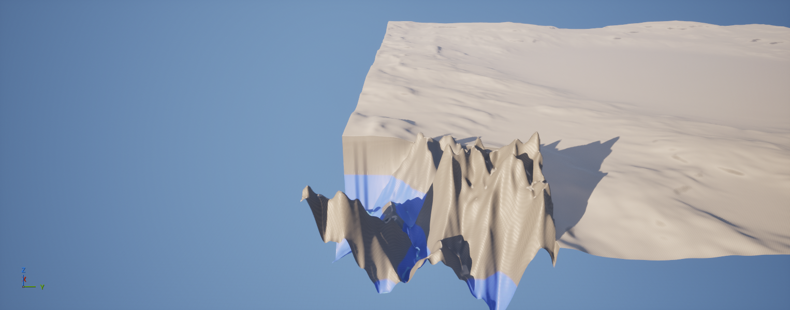
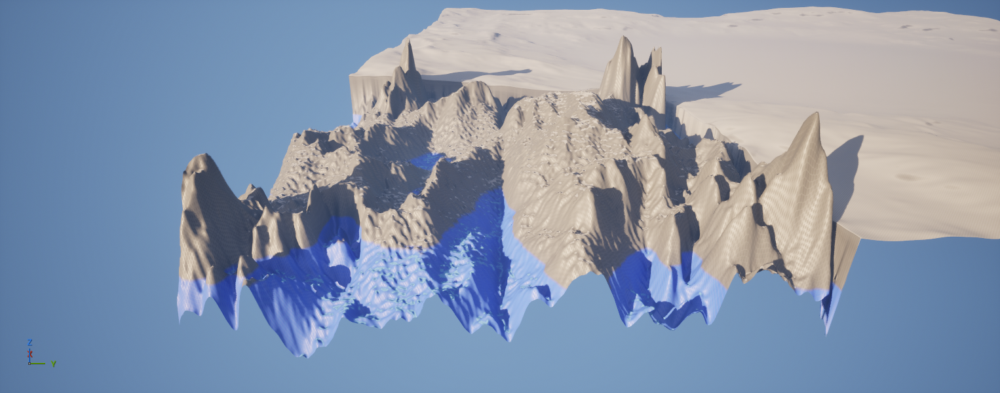

# Intelligent Terrain Generation for Unreal Engine 5

A diffusion-based system that generates realistic 3D terrain (heightmaps) from real elevation data, and imports the result into **Unreal Engine 5** as an explorable landscape.

A custom single-channel **DDPM** (Denoising Diffusion Probabilistic Model) is trained from scratch on real Digital Elevation Model (DEM) data of the Italian Alps, then scaled to large, seamless maps using **MultiDiffusion**.

Academic project — Tishreen University, Faculty of Informatics Engineering (AI Department), 2025–2026.

---

🚀 **[Try the live demo](https://terrain-diffusion-ue5-ambnhjjttyh3mpgpmn5xsk.streamlit.app/)** — generate a new heightmap right in your browser, no setup required.

---

## Results

| Single patch (DDPM, 256×256) | Large seamless map (MultiDiffusion, 512×512) |
|---|---|
|  |  |

| Imported into Unreal Engine 5 (DDPM) | Imported into Unreal Engine 5 (MultiDiffusion) |
|---|---|
|  |  |

The MultiDiffusion result shows clearly richer, more varied terrain — multiple connected ridgelines and valleys — with no visible seams between the underlying generation windows.

---

## Core Contribution

The project's main technical contribution is **making diffusion training practical on consumer hardware**. Training this model at full batch size and full precision overflows an 8 GB GPU's memory. This is solved with:

- **`bfloat16` mixed-precision training** — halves memory use and speeds up computation
- **Reduced batch size**, tuned to the remaining memory budget

Together, these cut the time per training step from ~32s to under 1s — a **~38x speed-up** — making it feasible to train a real diffusion model on a laptop GPU instead of requiring industrial-grade hardware.

---

## Pipeline

| Notebook | Purpose |
|---|---|
| [`01_setup_test.ipynb`](notebooks/01_setup_test.ipynb) | Environment sanity check — confirms `rasterio` can read the DEM file |
| [`02_data_exploration.ipynb`](notebooks/02_data_exploration.ipynb) | Inspects the raw Alps DEM: metadata, descriptive statistics, visualization |
| [`03_preprocessing.ipynb`](notebooks/03_preprocessing.ipynb) | Normalizes elevation to `[-1, 1]` and cuts the map into 442 patches of 256×256 |
| [`04_dataset.ipynb`](notebooks/04_dataset.ipynb) | Defines the PyTorch `Dataset` / `DataLoader` that feeds patches to the model |
| [`05_model.ipynb`](notebooks/05_model.ipynb) | Builds the U-Net diffusion model, trains it, generates a single patch and a large MultiDiffusion map, exports both as 16-bit PNGs for UE5 |

**Data flow:** `output_be.tif` (raw Alps DEM) → normalized `.npy` patches → `TerrainDataset` → DDPM training → reverse diffusion → 16-bit heightmap PNG → UE5 Landscape import tool.

---

## Technical Details

- **Model:** `UNet2DModel` (🤗 `diffusers`), single-channel in/out, ~61.8M parameters, 4 resolution levels (64→128→256→512 channels), attention at the deepest level
- **Scheduler:** `DDPMScheduler`, 1000 timesteps
- **Data:** real DEM of the Italian Alps (NASADEM/SRTM-derived), 442 non-overlapping 256×256 patches, elevation normalized to `[-1, 1]`
- **Training:** AdamW (lr=1e-4), batch size 4–8, `bfloat16` mixed precision
- **Scaling to large maps:** MultiDiffusion (Bar-Tal et al., 2023) — overlapping 256×256 windows blended at every denoising step, not just at the end, for global coherence with no visible seams
- **Export:** generated heightmaps rescaled to 16-bit grayscale PNG, imported via UE5's built-in Landscape tool

---

## Setup

```bash
conda create -n diffusion python=3.11
conda activate diffusion
pip install -r requirements.txt
```

**Data:** this repo does not include the raw DEM file (too large for git). Place your own Alps (or other region) DEM GeoTIFF at `data/output_be.tif` before running `01_setup_test.ipynb` and `02_data_exploration.ipynb`. NASADEM and SRTM data are available from [NASA Earthdata](https://earthdata.nasa.gov/).

## Usage

Run the notebooks in order (01 → 05). Each stage's output feeds the next:

```
01_setup_test.ipynb        # verify environment
02_data_exploration.ipynb  # inspect the DEM
03_preprocessing.ipynb     # normalize + extract patches -> outputs/processed/patches/
04_dataset.ipynb           # verify Dataset/DataLoader
05_model.ipynb             # train, generate, export -> outputs/heightmap_*.png
```

Import the resulting PNG into Unreal Engine 5 via **Landscape → Import from File**.

---

## Project Structure

```
.
├── notebooks/
│   ├── 01_setup_test.ipynb
│   ├── 02_data_exploration.ipynb
│   ├── 03_preprocessing.ipynb
│   ├── 04_dataset.ipynb
│   └── 05_model.ipynb
├── assets/                 # result images used in this README
├── data/                   # place your DEM GeoTIFF here (not included)
├── outputs/                # generated patches, checkpoints, heightmaps (not included)
├── requirements.txt
└── README.md
```

---

## Roadmap

This is phase one of a larger system. Planned next steps:

- Adapt an infinite-generation algorithm (e.g. *InfiniteDiffusion*) for true unbounded, seed-consistent terrain generation with constant-time random access
- Outpainting as an intermediate step toward seamless infinite generation
- Expand the training dataset to additional geographic regions
- Package as a native Unreal Engine 5 plugin instead of manual PNG import
- Add an ecological layer on top of terrain: vegetation, water bodies, automatic texturing by slope/elevation

---

## References

- J. Ho, A. Jain, P. Abbeel, "Denoising Diffusion Probabilistic Models," *NeurIPS*, 2020.
- A. Goslin, "Terrain Diffusion: A Diffusion-Based Successor to Perlin Noise in Infinite, Real-Time Terrain Generation," arXiv:2512.08309, 2025.
- K. Perlin, "An Image Synthesizer," *ACM SIGGRAPH Computer Graphics*, 1985.
- O. Bar-Tal, L. Yariv, Y. Lipman, T. Dekel, "MultiDiffusion: Fusing Diffusion Paths for Controlled Image Generation," *ICML*, 2023.

---

## Author

Zain Aldeen Aldaher — Informatics Engineering (AI Specialization), Tishreen University
Supervised by Dr. Mohammad Mashi
